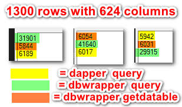
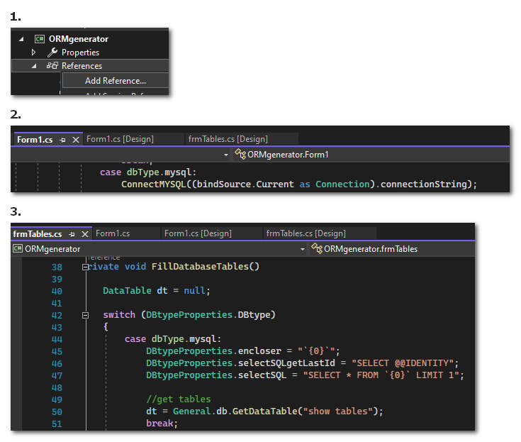

# ORMgenerator

So lately, start looking on ORMs... This application allows to `generate models by database`..  

From what I perceive there are 4 options 
* Dapper (1 dll, 195kb)
* NHibernate (heavy, for a **hello world** you need the dependencies overall 5.5mb)
* DBWrapper class made here ;) 
* ~20 other [ORMs](https://github.com/pipiscrew/small_prjs/tree/master/csharp_ORMs)

The **generated models** can be used all over ORMs..  

---

I was curious how this can be done in a homebrew version. The `DBWrapper` is a static class, which the user pass any connection, for example : 

```csharp
General.db = new DBASEWrapper(new OleDbConnection(connectionString));
General.db = new DBASEWrapper(new MySqlConnection(connectionString));
General.db = new DBASEWrapper(new SQLiteConnection(connectionString));
General.db = new DBASEWrapper(new SqlConnection(connectionString));
General.db = new DBASEWrapper(new Oracle.ManagedDataAccess.Client.OracleConnection(connectionString));
General.db = new DBASEWrapper(new MySqlConnection(connectionString));
```

afterwards user at **glance** have these :
* GetDataTable(string sql)
* GetDataTableWithSchema(string sql)
* GetDataReader(string sql)
* ExecuteScalar(string sql)
* Execute(string sql)
* ExecuteParams(string sql, IDbDataParameter[] parameters)
* `Query<T>(string sql, object parameters)`
* `QueryFirst<T>(string sql, object parameters)`
* `ExecuteModel<T>(string sql, T model)`
* GetConnection()
* ConnectionClose()
* IsConnected

---

Apart from `DBWrapper` and model genenerator, the application generates also a `Service.cs` for each model (aka table) :

```csharp
public bool Insert(Customer obj)
{
	var command = @"INSERT INTO [customers] ([cust_name],[cust_addess]) VALUES (@cust_name,@cust_addess)";
	var parms = new { obj.Cust_name, obj.Cust_addess };
	var result = General.db.ExecuteModel(command, parms);
	return result > 0;
}

public long InsertReturnId(Customer obj)
{
	var command = @"INSERT INTO [customers] ([cust_name],[cust_addess]) VALUES (@cust_name,@cust_addess)";
	var parms = new { obj.Cust_name, obj.Cust_addess };
	var result = General.db.ExecuteModel(command, parms);
	if (result > 0)
		return long.Parse(General.db.ExecuteScalar("SELECT last_insert_rowid()").ToString());
	else
		return 0;
}

public Customer Get(long id)
{
	var command = @"SELECT * FROM customers WHERE cust_id = @cust_id";
	var parms = new { cust_id = id };
	return General.db.QueryFirst<Customer>(command, parms);
}

public List<Customer> GetList()
{
	var command = @"SELECT * FROM customers";
	return General.db.Query<Customer>(command).ToList();
}

public bool Update(Customer obj)
{
	var command = @"UPDATE [customers] SET [cust_name] = @cust_name, [cust_addess] = @cust_addess where cust_id = @cust_id";
	var result = General.db.ExecuteModel(command, obj);
	return result > 0;
}

public bool Delete(long id)
{
	var command = @"DELETE FROM customers WHERE cust_id = @cust_id";
	var parms = new { cust_id = id };
	var result = General.db.ExecuteModel(command, parms);
	return result > 0;
}
```

examples :
```csharp
//query by 2 fields
var command = @"SELECT * FROM customers where cust_id=@cust_id and cust_name = @cust_name";
object obj = new { cust_id = 1005, cust_name = "test" });
General.db.Query<Customer>(command, obj).ToList();

//use of like
var command = @"SELECT * FROM customers where cust_name like @cust_name";
object obj = new { Cust_name = "%kuala%" });
General.db.Query<Customer>(command, obj).ToList();
```

---

## So after all, I put it on benchmark #LOL



all in all **Dapper** is the winner ;)   

the numbers are in miliseconds ( 1 second = 1000ms )... The sample application executed the following :

```csharp
//DBWrapper
    timer.Start();
    var x = General.db.Query<Customer>("select * from customers").ToList();
    timer.Stop();

//Datatable (DataAdapter Fill())
    timer.Start();
    var x = General.db.GetDataTable("select * from customers");
    timer.Stop();

//Dapper v2.0.143
    timer.Start();
    var x = General.db.GetConnection().Query<Customer>("select * from customers").ToList();
    timer.timer.Stop();
```

Each box illustrates a restart of the application. The first line means that this function executed first towards to end.. So here we see that `DBWrapper.Query` , is always on 2 digits, most possible because dealing with 624 columns ;) In normal tables, behaves with approximately 5ms difference (slower), compared to Dapper..

Moreover, Dapper has `cache` of fields mapping and other things.. 

---

Any new provider can be added in 3 simple steps  
1. add reference
2. declare the dbType
3. adjust 4 properties



---

The following databases tested & working : 
* sqlite
* mysql
* oracle (user have to download the managed oracle dll, have instruction in the code)

on *file-based databases*, user is able to *drag & drop* the file to the form.  

greets to [Hytm/CockroachDB-Dapper-Example](https://github.com/Hytm/CockroachDB-Dapper-Example) for the service pattern...
